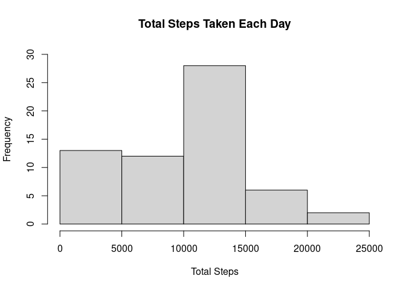
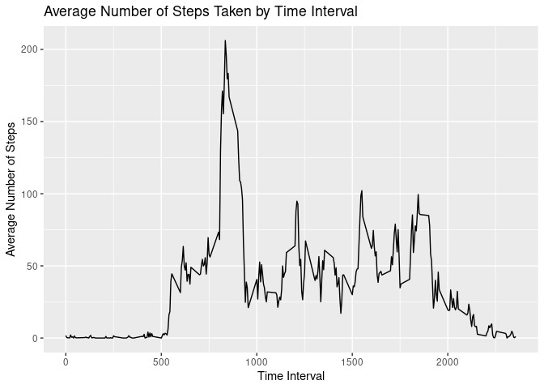
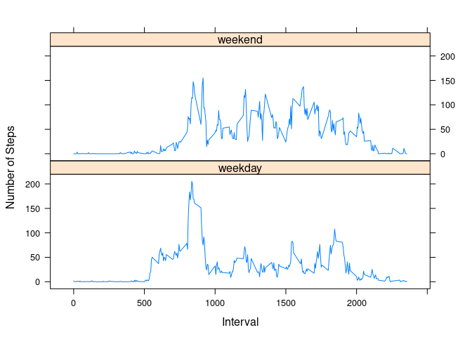

```r
library("tidyverse")
library("ggplot2")
library("lattice")
library("lubridate")
```
## Loading and preprocessing the data


```r
unzip("activity.zip")
activity <- read_csv("activity.csv")
```
## What is mean total number of steps taken per day?


```r
tot_step <- activity %>%
  group_by(date) %>%
  summarize(total_steps = sum(steps, na.rm = TRUE))

with(tot_step, hist(total_steps, main = "Total Steps Taken Each Day", xlab = "Total Steps", ylim = c(0,30)))
```

<!-- -->

```r
mean_step <- round(mean(tot_step$total_steps, na.rm = T), 0)
median_step <- round(median(tot_step$total_steps, na.rm = T), 0)

clean_median_step <- format(median_step, scientific = F)
```

This graph is a histogram that displays the frequency of total number of steps per day within these data. The average total number of steps taken per day is 9354. The median total number of steps taken per day is 10395.

## What is the average daily activity pattern?


```r
interval_averages <- activity %>%
  group_by(interval) %>%
  summarize(avg_steps = mean(steps, na.rm = TRUE))

ggplot(interval_averages, aes(x = interval, y = avg_steps)) +
  geom_line() +
  labs(title = "Average Number of Steps Taken by Time Interval", x = "Time Interval", y = "Average Number of Steps")
```

<!-- -->

```r
max_avg_steps <- interval_averages[which.max(interval_averages$avg_steps), "interval"]
```
This graph shows the average number of steps taken per 5 minute time interval within these data. We can see from the graph that the average number of steps taken by time interval peaks at the 5 minute time interval 835.

## Imputing missing values


```r
total_missing <- length(which(is.na(activity)))

imputed_steps <-ave(activity$steps,activity$interval,FUN=function(x) 
  ifelse(is.na(x), median(x,na.rm=TRUE), x))

activity_imputed <- data.frame(steps = imputed_steps, interval = activity$interval, date = activity$date)

imputed_tot_step <- activity_imputed %>%
  group_by(date) %>%
  summarize(total_steps = sum(steps, na.rm = TRUE))

with(imputed_tot_step, hist(total_steps, main = "Total Steps Taken Each Day", xlab = "Total Steps", ylim = c(0,30)))
```

<!-- -->

```r
imputed_mean_step <- round(mean(imputed_tot_step$total_steps, na.rm = T), 0)
imputed_median_step <- median(imputed_tot_step$total_steps, na.rm = T)

clean_imputed_median_step <- format(imputed_median_step, scientific = F)

mean_change <- round(imputed_mean_step - mean_step, 0)
median_change <- imputed_median_step - median_step

median_change <- format(median_change, scientific=F)
```
This graph shows the frequency of steps taken per day after imputing missing values. Missing values were imputed using the median value for their corresponding 5 minute time intervals. The mean number of steps per day is 9504 and the median number of steps per day is 10395. We can see that the mean number of steps per day is increased by about 150 compared to without imputation. The median number of steps per day remains unchanged using this method. Imputing the data causes the number of steps per day to go up, which is what we would expect given that we are filling in missing data with values that can only be positive.

## Are there differences in activity patterns between weekdays and weekends?


```r
activity_imputed$day_type <- factor(with(activity_imputed, ifelse(weekdays(date) == "Sunday" | weekdays(date) == "Saturday", "weekend", "weekday")))

mean_day_type <- activity_imputed %>%
  group_by(day_type, interval) %>%
  summarize(steps = mean(steps, na.rm = TRUE))

with(mean_day_type, xyplot(steps~interval | day_type, type = "l", xlab = "Interval", ylab = "Number of Steps", layout = c(1,2)))
```

<!-- -->

We can see from this graph that step activity on weekends tends to have two peaks, the largest of which is between 800 and 900, whereas weekend step activity is more consistent, but never reaches the level of the first weekday peak. Note that this is impacted by the imputation methods discussed above.

